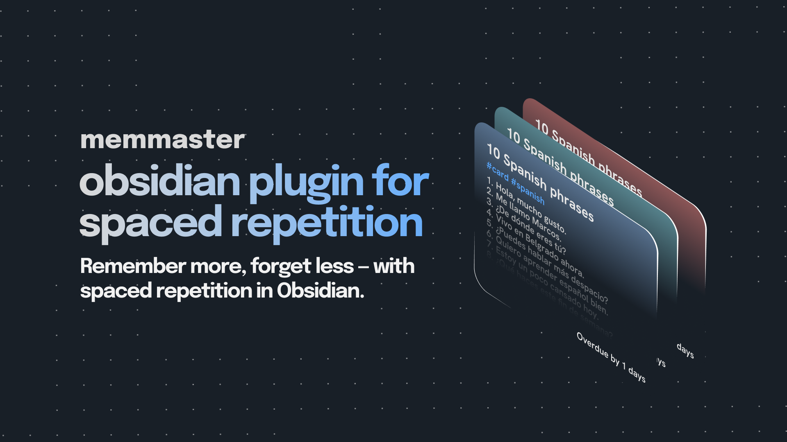
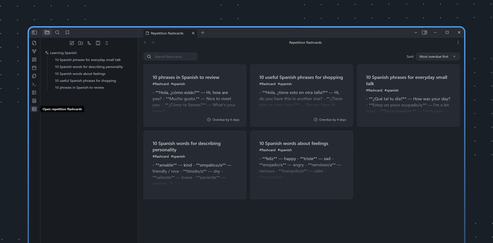
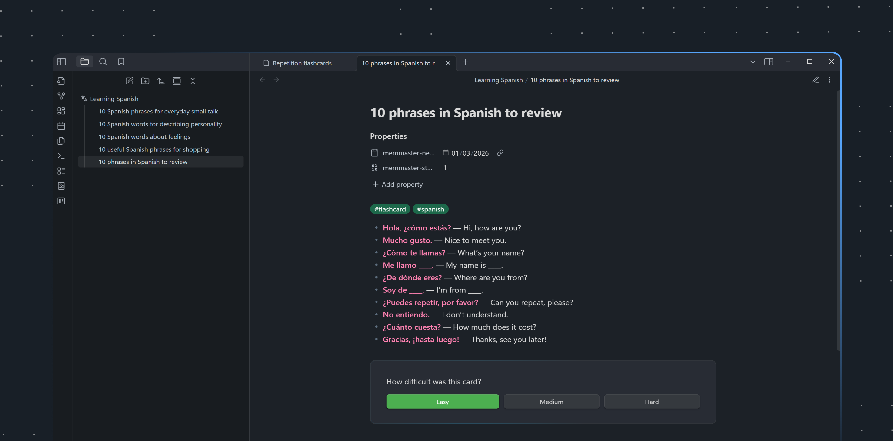

# MemMaster — Spaced Repetition for Obsidian

A simple yet powerful spaced repetition plugin that helps you memorize your Obsidian notes using proven learning techniques.

## Features

- **Turn any note into a flashcard** — by tag or folder
- **Review list** — shows all cards due for review today, sorted by urgency
- **Difficulty rating** — mark cards as Easy, Medium, or Hard
- **Smart scheduling** — calculates optimal review intervals automatically
- **Keyboard shortcuts** — quick review without leaving the keyboard
- **Multilingual** — multiple language support

## How It Works

1. Mark a note as a flashcard (via command or by adding a tag/moving to folder)
2. The plugin adds metadata to track your progress
3. Review cards when they're due — rate difficulty after each review
4. Cards are rescheduled based on your rating:
   - **Easy** → longer interval (2^stage days)
   - **Medium** → moderate interval (1.5^stage days)  
   - **Hard** → shorter interval (1.2^stage days)
5. After 10 successful reviews, the card is considered "mastered" and removed from rotation

## Algorithm

This plugin uses a simplified version of the SM-2 (SuperMemo 2) algorithm. Unlike the original, it doesn't use an "ease factor" coefficient — instead, fixed base values are applied for each difficulty level, making the system more predictable and easier to understand.

## Installation

1. Open **Settings → Community plugins** in Obsidian
2. Click **Browse** and search for "MemMaster"
3. Click **Install**, then **Enable**
4. Configure your preferred flashcard source (tag or folder) in plugin settings

## Usage

| Command | Description |
|---------|-------------|
| `Open Review List View` | Open the review panel |
| `Make current document a flashcard` | Convert current note to flashcard |
| `Mark current card as Easy/Medium/Hard` | Rate card difficulty |
