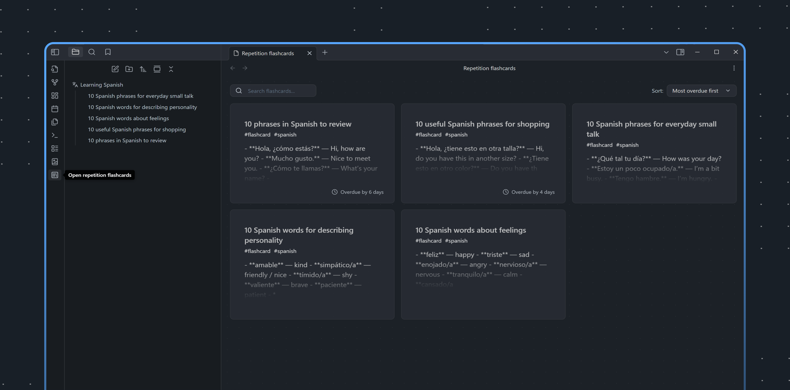
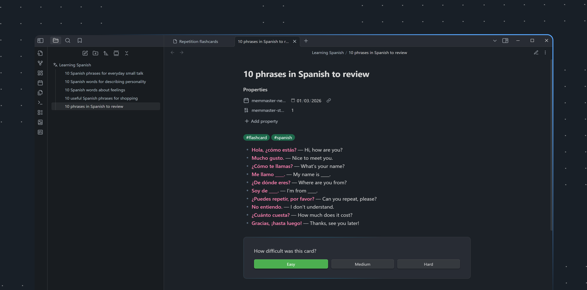

# MemMaster — Spaced Repetition for Obsidian

A simple yet powerful spaced repetition plugin that helps you memorize your Obsidian notes using flashcards, spaced repetition, active recall, and review scheduling.

## Features

- **Turn any note into a flashcard** — by tag or folder
- **Review list** — shows all cards due for review today, sorted by urgency
- **Completed cards** — mastered cards are moved to a separate Completed tab
- **Review completed cards again** — reset completed cards and return them to the review flow
- **Difficulty rating** — mark cards as Easy, Medium, or Hard
- **Smart scheduling** — calculates review intervals automatically
- **Character count warning** — helps keep flashcard notes focused and easy to review
- **Keyboard shortcuts** — quick review without leaving the keyboard
- **Responsive layout** — works better on smaller screens and mobile devices
- **Multilingual** — multiple language support
## How It Works

1. Mark a note as a flashcard by command, tag, or folder.
2. The plugin adds metadata to track your review progress.
3. Review cards when they're due and rate each card as Easy, Medium, or Hard.
4. Cards are rescheduled based on your rating:
   - **Easy** → longer interval (`2^stage` days)
   - **Medium** → moderate interval (`1.5^stage` days)
   - **Hard** → shorter interval (`1.2^stage` days)
5. After 10 successful reviews, the card is considered completed and moved out of the active review queue.
6. Completed cards remain available in the Completed tab and can be reset if you want to review them again.

## Algorithm

MemMaster uses a simplified version of the SM-2 (SuperMemo 2) algorithm.

Unlike the original SM-2 algorithm, it doesn't use an "ease factor" coefficient. Instead, fixed base values are applied for each difficulty level, making the system more predictable and easier to understand.

## Installation

1. Open **Settings → Community plugins** in Obsidian.
2. Click **Browse** and search for **MemMaster**.
3. Click **Install**, then **Enable**.
4. Configure your preferred flashcard source, such as tag or folder, in plugin settings.

## Usage

| Command | Description |
|---------|-------------|
| `Open Review List View` | Open the review panel |
| `Make current document a flashcard` | Convert current note to flashcard |
| `Mark current card as Easy/Medium/Hard` | Rate card difficulty |

## Completed Cards

When a card reaches the final review stage, MemMaster marks it as completed instead of removing all plugin metadata.

Completed cards are excluded from the regular review queue, but they remain visible in the Completed tab. You can reset a completed card if you want to review it again.
