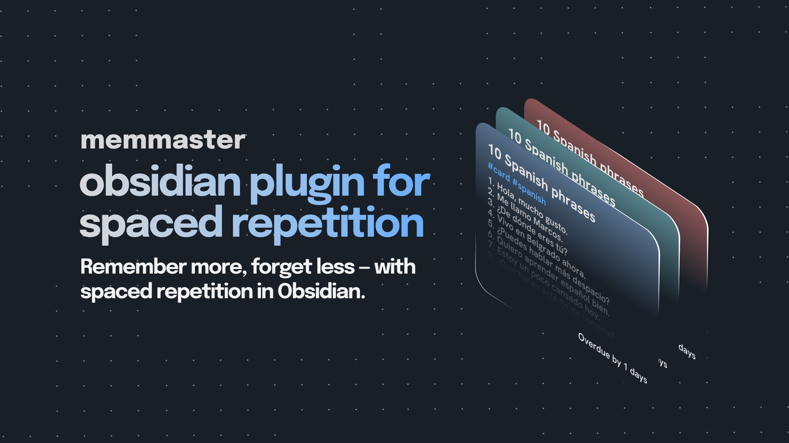
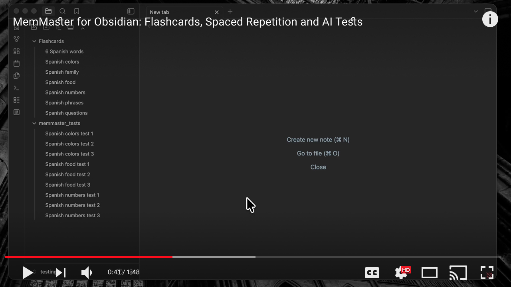
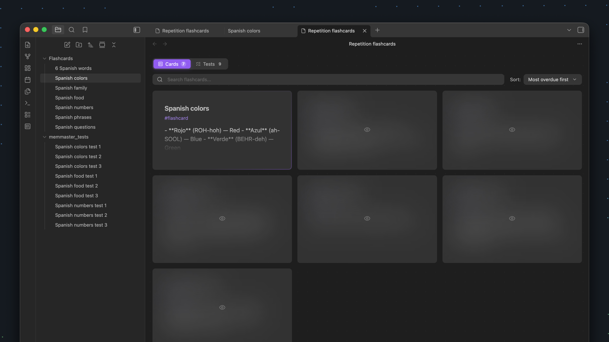
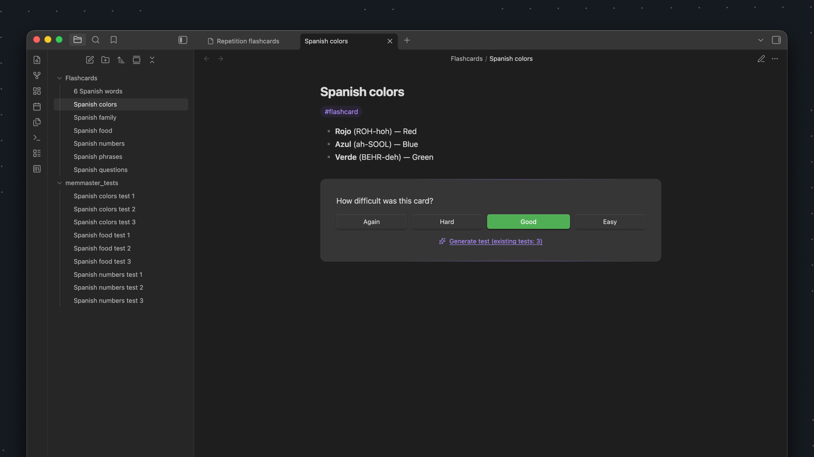
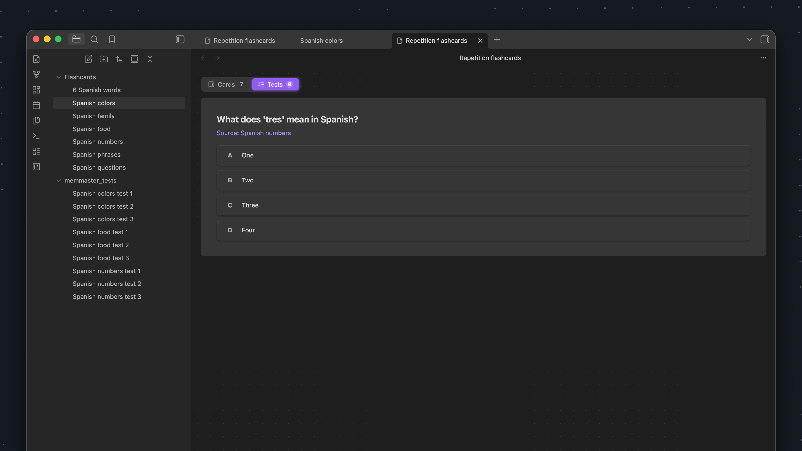
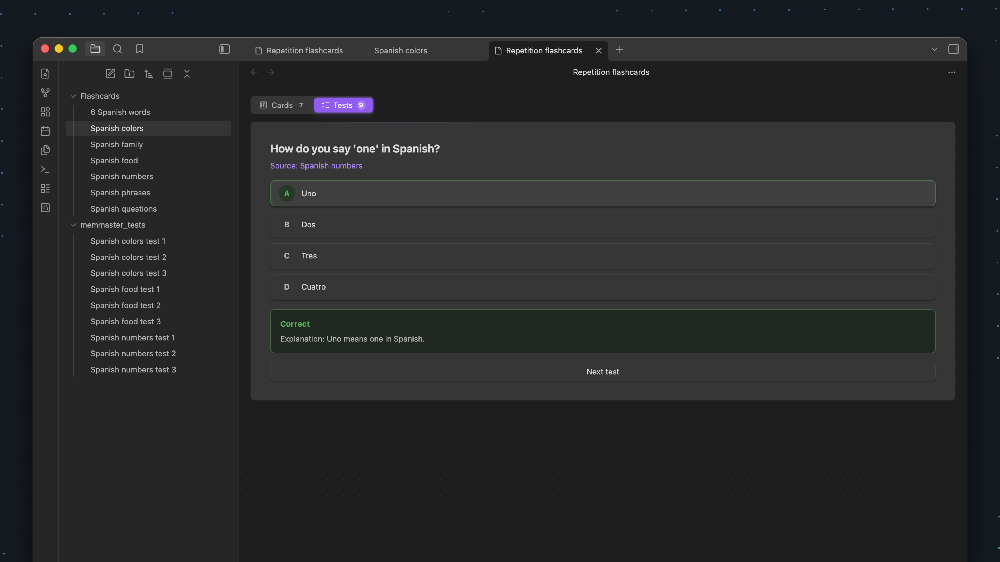

# MemMaster Flashcards + AI Tests

A simple yet powerful spaced repetition plugin that helps you memorize your Obsidian notes using flashcards, AI-generated tests, quizzes, spaced repetition, active recall, and review scheduling.

## Features

- **Turn any note into a flashcard** — by tag or folder
- **Review list** — shows all cards due for review now, sorted by urgency
- **Difficulty rating** — mark cards as Again, Hard, Good, or Easy
- **FSRS scheduling** — calculates adaptive review intervals with the Free Spaced Repetition Scheduler
- **AI-generated tests** — generate multiple-choice tests and quizzes from flashcards
- **OpenAI and DeepSeek support** — choose an AI provider and model for test generation
- **Tests review mode** — answer generated tests in a dedicated review flow with explanations
- **Markdown test files** — generated tests are saved in your vault and linked to source cards
- **Character count warning** — helps keep flashcard notes focused and easy to review
- **Keyboard shortcuts** — quick review without leaving the keyboard
- **Responsive layout** — works better on smaller screens and mobile devices
- **Multilingual interface** — English and Russian translations

## How It Works

1. Mark a note as a flashcard by command, tag, or folder.
2. The plugin adds metadata to track your review progress.
3. Review cards when they're due and rate each card as Again, Hard, Good, or Easy.
4. Optionally generate AI tests from a flashcard using OpenAI or DeepSeek.
5. Review generated tests in the Tests mode and choose the correct answer.
6. Cards and tests are rescheduled by FSRS based on the current memory state and your rating or answer.
7. Due cards and tests return to the review queue when their scheduled review time arrives.

## Algorithm

MemMaster uses FSRS (Free Spaced Repetition Scheduler) through the `ts-fsrs` package. Short-term minute-based learning steps are disabled, so scheduled reviews are at least one day apart. Each card stores its FSRS memory state in frontmatter: due time, state, stability, difficulty, scheduled interval, repetition count, lapse count, learning step, and last review time.

When upgrading from the legacy stage-based scheduler to FSRS, MemMaster resets old review state once and starts legacy cards from a fresh FSRS state.

## AI Tests

MemMaster can generate up to 3 multiple-choice tests from a source flashcard. Tests use OpenAI or DeepSeek, are saved as Markdown files in your vault, and include the question, answer options, correct answer, explanation, source card link, review time, and FSRS state.

Generated tests appear in the Tests mode of the review list. Correct answers are scheduled as Good; wrong answers are scheduled as Again and return according to the FSRS schedule.

## Installation

1. Open **Settings → Community plugins** in Obsidian.
2. Click **Browse** and search for **MemMaster**.
3. Click **Install**, then **Enable**.
4. Configure your preferred flashcard source, such as tag or folder, in plugin settings.
5. To use AI tests, enable tests in settings, choose OpenAI or DeepSeek, add your API key, and select a tests folder.

## Privacy

MemMaster stores review metadata, generated tests, and plugin settings in your Obsidian vault. Flashcard review is local-only. When you generate AI tests, the source card content is sent to your selected provider, OpenAI or DeepSeek, using the API key stored in your local plugin settings.

## Usage

| Command | Description |
|---------|-------------|
| `Open Review List View` | Open the review panel |
| `Make current document a flashcard` | Convert current note to flashcard |
| `Clear MemMaster metadata from current document` | Remove all `memmaster-*` frontmatter fields from the current note |
| `Mark current card as Again/Hard/Good/Easy` | Rate card recall |
| `Generate test` button | Generate AI tests from the current flashcard |
